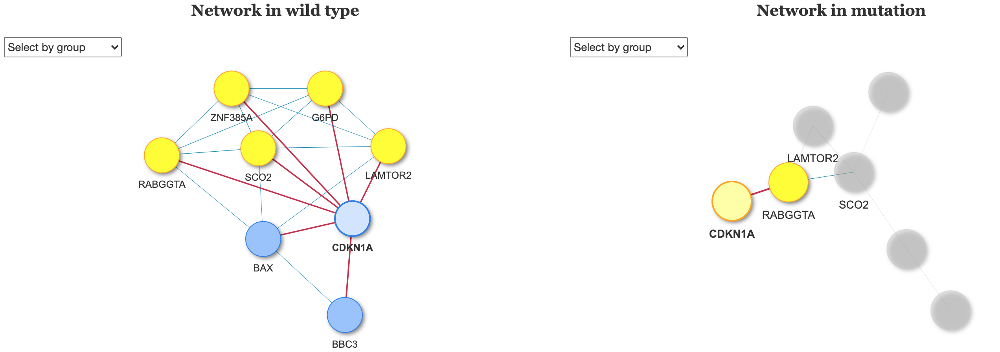

# **TCGANetwork**
TCGA gene co-expression network analysis by mutation status

## **Abstract**
There are number of gene networks that regulates by mutation by transcription target genes in various cancer. This package aims to analyze these networks under the certain mutation status.

## **Approach**
In order to figure out these network, we analyze cancer RNAseq data from TCGA database. 
  1. Retrive RNAseq data from TCGA database.
  1. RNAseq by **gene1** mutation.
  1. Build network of **gene2**
  1. Comparison Network of **gene2** by mutation of **gene1** 

### Installation

The **development** version can be installed from GitHub using:

``` r
devtools::install_github("ilwookkim/TCGANetwork")
```

### Usage

``` r
library(TCGANetwork)

TCGA_study_name = "STAD"
gene1 = "TP53"
pipeline = "mutect2"
gene2 = "CDKN1A"
```

**TCGA RNAseq data download**

``` r
countdata <- TCGA_RNAseq_RSEM(TCGA_study_name)
```

**Mutation information**

``` r
# There are four pipelines: muse, varscan2, somaticsniper, mutect2
mut_df <- mutation_info(countdata,TCGA_study_name, gene = gene1, pipeline = "mutect2")
```

**Neighbor genes finder**

``` r
common_neighbor <- neighbor_finder(countdata, 
                                  gene=gene2, 
                                  cor_method = "spearman", 
                                  cor.cut.off=.39, 
                                  weight.cut.off=.2)
```

**TCGA Network by mutation status of interesting gene**

``` r
TCGANetwork_list <- TCGANetwork(countdata, mut_df, 
                                common_neighbor, 
                                cor_method = "spearman", 
                                weight.cut.off=.5)
```

**Interactive clustered network plots by mutation status using shiny and visNetwork**
``` r
Netplot(TCGANetwork_list, interest_gene = gene2, mut_gene = gene1)
```
- 

**Network using Cytoscape**

  1. Download and Install Cytoscape.
    https://cytoscape.org/download.html
  1. Open Cytoscape
  1. Install plugin **Diffany**
  1. Run below in R
  ``` r
  g1 <- TCGANetwork_list[[1]]
  g2 <- TCGANetwork_list[[2]]
  RCy3::createNetworkFromIgraph(g1,"network_wt")
  RCy3::createNetworkFromIgraph(g2,"network_mut")
  ```
  1. Save network file as .cys.
  1. Import network_wt.cys and network_mut.cys files
  1. Apps/Diffany > Run Diffany project
  1. Go to Diffany tab
  1. Input networks window : include - check Two networks, Reference - check wt network
  1. Options window : Comparison mode - here I used One to all, Cutoff - Here I used 0.5 Check Differntial networks and Consensus networks.
  1. Press Start
  1. export image


  Red: Up-regulate in Mut - Green: Down-regulate in Mut
